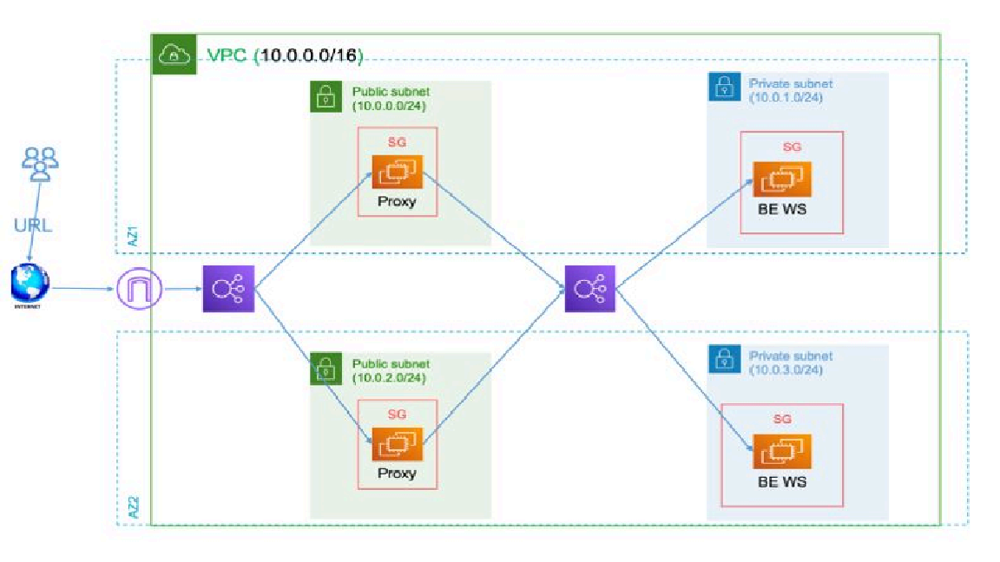

# Multi-Tier Proxy Infrastructure with Terraform

A comprehensive AWS infrastructure deployment using Terraform that creates a scalable, multi-tier architecture with proxy servers, load balancers, and backend instances across multiple availability zones.

## Architecture Diagram


*Complete architecture diagram showing the multi-tier proxy infrastructure with VPC, subnets, load balancers, EC2 instances, and traffic flow*

## Architecture Overview

This project deploys a robust multi-tier infrastructure on AWS featuring:

- **Public Tier**: Internet-facing Application Load Balancer and Nginx proxy instances
- **Private Tier**: Internal Application Load Balancer and backend web servers
- **Network Isolation**: Separate public and private subnets with NAT Gateway
- **High Availability**: Resources distributed across multiple availability zones
- **State Management**: Remote Terraform state with S3 and DynamoDB locking

## Infrastructure Components

### Network Architecture
- **VPC**: Custom VPC with configurable CIDR (default: 10.0.0.0/16)
- **Public Subnets**: 2 subnets across different AZs for proxy instances
- **Private Subnets**: 2 subnets across different AZs for backend instances
- **Internet Gateway**: Provides internet access to public subnets
- **NAT Gateway**: Enables outbound internet access for private subnets

### Load Balancers
- **Public ALB**: Internet-facing load balancer distributing traffic to proxy instances
- **Private ALB**: Internal load balancer distributing traffic to backend instances

### EC2 Instances
- **Proxy Instances**: 2 Nginx reverse proxy servers in public subnets
- **Backend Instances**: 2 Apache web servers in private subnets

### Security Groups
- **Public ALB SG**: Allows HTTP traffic from internet
- **Proxy SG**: Allows traffic from public ALB and management access
- **Private ALB SG**: Allows traffic from proxy instances
- **Backend SG**: Allows traffic from private ALB

## Prerequisites

- AWS CLI configured with appropriate credentials
- Terraform >= 1.0 installed
- Appropriate AWS IAM permissions for resource creation

## Quick Start

### 1. Clone and Configure

```bash
git clone <repository-url>
cd terraform-lab-3
```

### 2. Review Configuration

Edit `terraform.tfvars` to customize your deployment:

```hcl
# AWS Configuration
aws_region         = "us-east-1"
availability_zones = ["us-east-1a", "us-east-1b"]

# Network Configuration
vpc_cidr             = "10.0.0.0/16"
public_subnet_cidrs  = ["10.0.1.0/24", "10.0.3.0/24"]
private_subnet_cidrs = ["10.0.2.0/24", "10.0.4.0/24"]

# Instance Configuration
instance_type = "t3.micro"
project_name  = "multi-tier-proxy"
environment   = "dev"
```

### 3. Deploy Infrastructure

```bash
# Initialize Terraform
terraform init

# Plan the deployment
terraform plan

# Apply the configuration
terraform apply
```

### 4. Access Your Application

After deployment, access your application using the public ALB URL:
```bash
# Get the public ALB URL
terraform output public_alb_url
```

## Project Structure

```
├── main.tf                 # Main Terraform configuration
├── variables.tf            # Variable definitions
├── outputs.tf             # Output definitions
├── terraform.tfvars       # Variable values
├── modules/               # Terraform modules
│   ├── vpc/              # VPC and networking
│   ├── ec2/              # EC2 instance management
│   ├── load_balancer/    # ALB configuration
│   ├── security_groups/  # Security group rules
│   ├── nat_gateway/      # NAT Gateway setup
│   └── remote_backend/   # S3 and DynamoDB for state
└── README.md             # This file
```

## Configuration Details

### Network Configuration
- **VPC CIDR**: 10.0.0.0/16 (65,536 IP addresses)
- **Public Subnets**: 10.0.1.0/24, 10.0.3.0/24 (256 IPs each)
- **Private Subnets**: 10.0.2.0/24, 10.0.4.0/24 (256 IPs each)

### Instance Details
- **Instance Type**: t3.micro (1 vCPU, 1 GB RAM)
- **AMI**: Latest Amazon Linux 2
- **Access**: AWS Systems Manager Session Manager (no SSH keys required)

### Current Deployment IPs
Based on `all-ips.txt`:
- **Proxy Instance 1**: 34.238.42.178 (public), 10.0.1.x (private)
- **Proxy Instance 2**: 34.205.156.222 (public), 10.0.3.x (private)
- **Backend Instance 1**: 10.0.2.94 (private)
- **Backend Instance 2**: 10.0.2.84 (private)

## Traffic Flow

1. **Internet → Public ALB** (Port 80)
2. **Public ALB → Proxy Instances** (Port 80)
3. **Proxy Instances → Private ALB** (Port 80)
4. **Private ALB → Backend Instances** (Port 80)

## Security Features

- **Network Isolation**: Private instances have no direct internet access
- **Security Groups**: Restrictive rules allowing only necessary traffic
- **NAT Gateway**: Secure outbound internet access for private instances
- **Health Checks**: ALB health checks ensure instance availability

## Monitoring and Health Checks

- **ALB Health Checks**: `/health` endpoint on all instances
- **Target Groups**: Automatic instance registration and health monitoring
- **CloudWatch**: Automatic logging and monitoring (via AWS ALB)

## Outputs

The deployment provides several useful outputs:

```bash
# View all outputs
terraform output

# Specific outputs
terraform output public_alb_url          # Application URL
terraform output proxy_public_ips        # Proxy instance public IPs
terraform output backend_private_ips     # Backend instance private IPs
terraform output vpc_id                  # VPC identifier
```

## Customization

### Scaling Instances
Modify the `instance_count` parameter in the EC2 modules within `main.tf`:

```hcl
module "proxy_instances" {
  source = "./modules/ec2"
  instance_count = 3  # Scale to 3 proxy instances
  # ... other configuration
}
```

### Changing Instance Types
Update `instance_type` in `terraform.tfvars`:

```hcl
instance_type = "t3.small"  # Upgrade to t3.small
```

### Adding Environments
Create environment-specific `.tfvars` files:

```bash
# Production deployment
terraform apply -var-file="prod.tfvars"
```

## Troubleshooting

### Common Issues

1. **State Lock**: If deployment fails due to state lock:
   ```bash
   terraform force-unlock <lock-id>
   ```

2. **Resource Limits**: Check AWS service quotas for your region

3. **Health Check Failures**: Verify security group rules and instance health

### Accessing Instances
Use AWS Systems Manager Session Manager:

```bash
# Connect to proxy instance
aws ssm start-session --target <proxy-instance-id>

# Connect to backend instance
aws ssm start-session --target <backend-instance-id>
```

## Cleanup

To destroy all resources:

```bash
terraform destroy
```

**Warning**: This will permanently delete all infrastructure resources.

## Contributing

1. Fork the repository
2. Create a feature branch
3. Make your changes
4. Test the deployment
5. Submit a pull request

## License

This project is licensed under the MIT License - see the LICENSE file for details.

## Additional Documentation

For detailed screenshots and step-by-step deployment process, please refer to `terraform_lab3_screenshots.pdf` included in this repository.